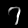
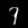
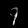

# VAE Experiment
My VAE (Variational Auto-Encoder) experiment using PyTorch.

---

Original paper: https://arxiv.org/pdf/1312.6114 (_Auto-Encoding Variational Bayes_)

Dataset: MNIST

---

## Introduction

This is a VAE experiment, implemented a simple VAE model with PyTorch.

## Setup

Please make sure you have already installed pytorch.

If you didn't, you can run:
~~~
pip install -r requirements.txt
~~~

Then PyTorch will be installed in your current Python environment.

## Training

### Train a Model from Scratch

To train a model from scratch, you can simply run the `train.py` file.

~~~
python train.py
~~~

**When you're running `train.py` at the first time, it will take some time to download dataset.**

### Continue Training from a checkpoint

You can use `-f` to specify your checkpoint to continue training.

~~~
python train.py -f ./checkpoints/your-checkpoint.pth
~~~

You can check more arguments via this command:

~~~
python train.py -h
~~~

## Inference

To start an inference, you can use `-f` to specify your checkpoint, and `-n` to set how many images to generate.

Here's an example:

~~~
python infer.py -f ./checkpoints/your-checkpoint.pth -n 4
~~~

Then 4 images will be generated in the `out` directory.

You can check more arguments via this command:

~~~
python infer.py -h
~~~

## Result

I trained with `batch_size=64` and 25,000 iterations, then I got:

